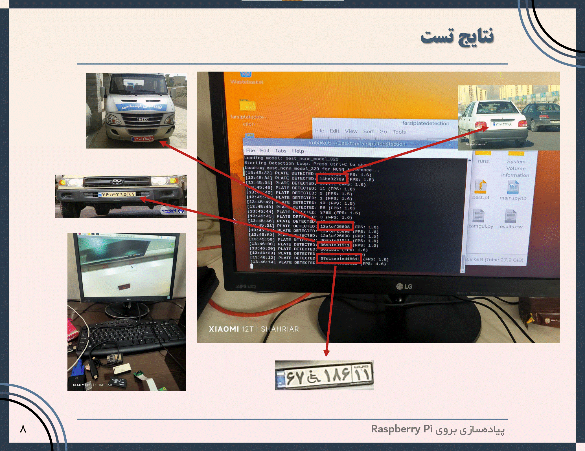

# Iranian License Plate Recognition on Raspberry Pi

[](https://www.python.org/)
[](https://pytorch.org/)
[](https://github.com/ultralytics/ultralytics)
[](LICENSE)

A complete end-to-end system for detecting and recognizing Iranian license plates using YOLOv8, optimized for deployment on Raspberry Pi 5 with real-time inference capabilities.

<p align="center">
  
</p>

## 🎯 Project Overview

This project implements a unified **License Plate Recognition (LPR)** system specifically designed for Iranian vehicles, including special categories often missed by commercial systems:

- **Standard plates** (private vehicles)
- **Diplomatic plates** (D series)
- **Service plates** (S series)  
- **Disabled person plates** (ژ symbol)
- **Protocol/Official plates** (تشریفات)
- **Taxi plates**

### Key Features

✅ **Unified Architecture**: Single YOLOv8n model detects both plate regions and individual characters simultaneously  
✅ **41 Classes**: Comprehensive coverage including digits (0-9), Persian letters (25 characters), and special symbols  
✅ **Data Augmentation**: Targeted augmentation strategy to handle class imbalance  
✅ **Embedded Deployment**: Optimized for Raspberry Pi 5 with NCNN backend (1.4-1.5 FPS)  
✅ **Real-time Performance**: Achieves ~650ms latency per frame on ARM CPU

## 📊 Performance Metrics

| Metric | Value |
|--------|-------|
| mAP@50 | 92.8% |
| mAP@50-95 | 82.4% |
| Precision | 95.1% |
| Recall | 88.7% |
| Standard Plates Accuracy | >95% |
| Special Plates Accuracy | 87-90% |
| Inference Time (RPi5 + NCNN) | ~650ms |
| FPS (Raspberry Pi 5) | 1.4-1.5 |

## 🏗️ Architecture

```
Input Image (640×640)
    ↓
YOLOv8n Backbone (CSPDarknet)
    ↓
PAN Neck (Multi-scale Features)
    ↓
Detection Head
    ↓
├─ Plate Region (1 class)
└─ Characters (40 classes)
    ├─ Digits: 0-9
    ├─ Persian Letters: الف، ب، پ، ...
    └─ Special Symbols: D، S، ژ، ...
```

## 🚀 Quick Start

### Prerequisites

- Python 3.8+
- CUDA-capable GPU (for training)
- Raspberry Pi 5 with 2GB+ RAM (for deployment)
- RPi Camera Module (optional, for real-time inference)

### Installation

1. **Clone the repository**
```bash
git clone https://github.com/shahriar-hd/FarsiPlateRecognition
cd FarsiPlateRecognition
```

2. **Install dependencies**
```bash
# For training (GPU environment)
pip install -r requirements.txt

# For Raspberry Pi deployment
pip install -r requirements-rpi.txt
```

3. **Download the dataset**

Download dataset from Google Drive at [IR-LPR](https://github.com/mut-deep/IR-LPR) repository.

## 📚 Usage

### 1. Dataset Preparation

Convert the IR-LPR dataset from XML format to YOLO format:

```bash
python dataset.py
```

This creates:
- `yolo_dataset/images/` - Organized train/val/test images
- `yolo_dataset/labels/` - YOLO format annotations
- `yolo_dataset/data.yaml` - Dataset configuration

### 2. Data Augmentation

Balance the dataset by augmenting underrepresented classes:

```bash
python aug.py
```

Configuration in `aug.py`:
```python
TARGET_COUNT = 5000  # Minimum instances per class
TARGET_CLASSES = ["pe", "se", "shin", "za", "kaf", "gaf", 
                  "disabled", "protocol", "S", "D"]
```

### 3. Training

Train YOLOv8n model on the prepared dataset:

```bash
python train.py
```

Training parameters:
- **Model**: YOLOv8n (3.2M parameters)
- **Epochs**: 20 (with early stopping)
- **Batch Size**: 64
- **Image Size**: 640×640
- **Device**: GPU (CUDA)

### 4. Testing

Test the trained model on images:

```bash
python test.py
```

Results saved to `output_results/` with annotated bounding boxes and plate text.

### 5. Deployment on Raspberry Pi

#### 5.1 Export Model to NCNN

```bash
yolo export model=best.pt format=ncnn imgsz=640
```

This creates `best_ncnn_model/` folder with optimized weights for ARM CPU.

#### 5.2 Setup Raspberry Pi

**Hardware Requirements:**
- Raspberry Pi 5 (2GB+ RAM)
- RPi Camera Module v3
- 64GB USB Flash Drive (for boot)
- Passive heatsink

**Software Setup:**
```bash
# Update EEPROM for USB boot
sudo rpi-eeprom-update -a
sudo reboot

# Install dependencies
sudo apt update
sudo apt install python3-pip libopenblas-dev libjpeg-dev

# Install PyTorch for ARM
pip3 install torch torchvision --index-url https://download.pytorch.org/whl/cpu

# Install Ultralytics and PiCamZero
pip3 install ultralytics picamzero
```

#### 5.3 Run Real-time Inference

```bash
python rpi.py
```

Output format:
```
[14:23:15] PLATE DETECTED: 12 | 345 ب 67 (FPS: 1.4)
[14:23:17] PLATE DETECTED: 89 | 234 ژ 56 (FPS: 1.5)
```

## 📁 Project Structure

```
iranian-lpr-yolo/
├── dataset.py              # XML to YOLO format converter
├── aug.py                  # Targeted data augmentation
├── train.py                # Model training script
├── test.py                 # Inference on test images
├── rpi.py                  # Raspberry Pi deployment
├── requirements.txt        # Python dependencies (GPU)
├── requirements-rpi.txt    # Python dependencies (RPi)
├── yolo_dataset/           # Processed dataset
│   ├── images/
│   │   ├── train/
│   │   ├── val/
│   │   └── test/
│   ├── labels/
│   │   ├── train/
│   │   ├── val/
│   │   └── test/
│   └── data.yaml
├── runs/                   # Training outputs
│   └── detect/
│       └── iran_lpr_model/
│           ├── weights/
│           │   ├── best.pt
│           │   └── last.pt
│           └── results.csv
└── output_results/         # Test inference outputs
```

## 🔧 Configuration

### Custom Augmentation Pipeline

Modify `aug.py` to adjust augmentation settings:

```python
aug_pipeline = A.Compose([
    A.Rotate(limit=25, p=0.8),                    # Rotation up to 25°
    A.RandomBrightnessContrast(p=0.5),            # Lighting variations
    A.HueSaturationValue(p=0.4),                  # Color shifts
    A.GaussNoise(var_limit=(10.0, 50.0), p=0.3),  # Sensor noise
    A.MotionBlur(blur_limit=3, p=0.2),            # Motion simulation
], bbox_params=A.BboxParams(format='yolo', label_fields=['class_labels']))
```

**Note**: No horizontal/vertical flips used, as Iranian plates are not symmetric.

### Training Hyperparameters

Edit `train.py` for custom training:

```python
results = model.train(
    data='yolo_dataset/data.yaml',
    epochs=20,              # Number of training epochs
    imgsz=640,              # Input image size
    batch=64,               # Batch size (adjust based on GPU memory)
    patience=10,            # Early stopping patience
    device=0,               # GPU device (0 for first GPU)
    workers=8,              # DataLoader workers
    
    # Disable default augmentations (not suitable for plates)
    fliplr=0.0,             # No horizontal flip
    flipud=0.0,             # No vertical flip
    mixup=0.0,              # No mixup
    copy_paste=0.0,         # No copy-paste
)
```

## 📈 Results Analysis

### Training Curves

<p align="center">
  
</p>

The model shows excellent convergence:

- **Box Loss**: 1.10 → 0.41 (localization accuracy)
- **Class Loss**: 1.67 → 0.22 (classification accuracy)
- **DFL Loss**: 1.19 → 0.91 (distribution focal loss)

### Per-Class Performance

| Class Category | Accuracy |
|----------------|----------|
| Digits (0-9) | 96-98% |
| Common Letters (ب، د، س) | 93-95% |
| Rare Letters (پ، ث، ژ) | 85-90% |
| Special Symbols (D، S، ژ) | 87-90% |
| Plate Region | 98% |

### Real-world Testing Scenarios

**Scenario 1: Lab Testing**
- High-resolution prints: 95%+ accuracy
- Angled plates: 80-85%
- Blurry images: 70-75%

**Scenario 2: University Parking**
- 2-4 meters distance: 90%+ detection
- 4-6 meters distance: 80-85%
- 6+ meters distance: 60-70%

**Scenario 3: Lighting Conditions**
- Sunny day: 90%+
- Cloudy: 85-90%
- Dusk: 80-85%
- Night (well-lit): 75-80%
- Night (low-light): 50-60%

## 🛠️ Optimization for Raspberry Pi

### Performance Breakdown

| Component | Time (ms) | Percentage |
|-----------|-----------|------------|
| Frame Capture | 50 | 7% |
| Preprocessing | 10 | 1.5% |
| **NCNN Inference** | **620** | **87%** |
| Postprocessing (NMS) | 30 | 4.5% |
| **Total** | **710** | **100%** |

**Bottleneck**: NCNN inference (87% of total time)

### Applied Optimizations

1. **Model Conversion**: PyTorch (.pt) → NCNN format
   - Utilizes ARM NEON SIMD instructions
   - Hand-optimized assembly for ARM Cortex-A76
   - **Result**: 3x speedup (0.5 → 1.5 FPS)

2. **CPU Governor**: Set to `performance` mode
   ```bash
   echo "performance" | sudo tee /sys/devices/system/cpu/cpu*/cpufreq/scaling_governor
   ```

3. **Thermal Management**: Passive heatsink
   - Temperature: 80°C → 65-70°C
   - Prevents thermal throttling

4. **Confidence Threshold**: Increased from 0.25 to 0.5
   - Reduces false positives
   - Less post-processing overhead

5. **Memory Management**:
   - Raspberry Pi OS Lite (no desktop environment)
   - Disabled unnecessary services
   - Increased swap to 2GB

## 📋 TODO List

### High Priority

- [ ] **Improve Low-light Performance**
  - Add IR illuminator support
  - Train on augmented night-time images
  - Experiment with low-light enhancement preprocessing

- [ ] **Increase Inference Speed**
  - [ ] Integrate Google Coral TPU (10x speedup potential)
  - [ ] Implement INT8 quantization (2-3x speedup, slight accuracy loss)
  - [ ] Test on NVIDIA Jetson Nano (GPU acceleration)
  - [ ] Explore model pruning techniques

- [ ] **Enhance Robustness**
  - Train on dirty/damaged plate images
  - Add rain/snow/fog augmentations
  - Handle partial occlusions better

### Medium Priority

- [ ] **Database Integration**
  - SQLite database for storing detections
  - Timestamp and location logging
  - Blacklist/whitelist functionality

- [ ] **Alert System**
  - Email/SMS notifications for flagged plates
  - Integration with security systems
  - Real-time dashboard

- [ ] **Multi-camera Support**
  - Handle multiple RPi Camera inputs
  - Synchronized detection across cameras
  - Coverage optimization

- [ ] **Mobile Application**
  - React Native or Flutter app
  - WiFi connection to Raspberry Pi
  - Live feed visualization
  - Detection history

### Low Priority

- [ ] **Multi-country Support**
  - Retrain for other plate formats
  - Automatic country detection
  - Unified interface for multiple regions

- [ ] **Advanced Analytics**
  - Traffic flow analysis
  - Peak hour detection
  - Vehicle counting and categorization

- [ ] **Cloud Integration**
  - Upload detections to cloud storage
  - Remote model updates
  - Centralized monitoring dashboard

- [ ] **Performance Optimizations**
  - TensorRT conversion for Jetson devices
  - Multi-threading for preprocessing
  - Batch inference for offline processing

## 🤝 Contributing

Contributions are welcome! Please feel free to submit a Pull Request.

### How to Contribute

1. Fork the repository
2. Create your feature branch (`git checkout -b feature/AmazingFeature`)
3. Commit your changes (`git commit -m 'Add some AmazingFeature'`)
4. Push to the branch (`git push origin feature/AmazingFeature`)
5. Open a Pull Request

### Contribution Guidelines

- Follow PEP 8 style guide for Python code
- Add comments for complex logic
- Update documentation for new features
- Include test results for performance improvements

## 📝 Citation

If you use this project in your research, please cite:

```bibtex
@misc{FarsiPlateRecognition,
  title={Iranian License Plate Recognition on Raspberry Pi},
  author={Khodabakhsh, Amirhossein and Hooshmand, Shahriar and Farhadian, Ali and Amiri, Ramtin and Ebrahimi, Sepehr},
  year={2026},
  publisher={GitHub},
  url={https://github.com/shahriar-hd/FarsiPlateRecognition}
}
```

## 📄 License

This project is licensed under the MIT License - see the [LICENSE](LICENSE) file for details.

## 🙏 Acknowledgments

- **Dataset**: [IR-LPR Dataset](https://github.com/mut-deep/IR-LPR) by Khalili et al.
- **Framework**: [Ultralytics YOLOv8](https://github.com/ultralytics/ultralytics)
- **Augmentation**: [Albumentations](https://github.com/albumentations-team/albumentations)
- **NCNN**: [Tencent NCNN](https://github.com/Tencent/ncnn)
- **Camera Library**: [PiCamZero](https://github.com/raspberrypilearning/picamzero)

Special thanks to **Professor Mahdi Heydarian** for guidance and supervision.

## 👥 Team Members

| Name | Role | GitHub | Email |
|------|------|--------|-------|
| **Amirhossein Khodabakhsh** | Project Lead, YOLO Architecture | - | [amk555hhh@gmail.com](mailto://amk555hhh@gmail.com) |
| **Shahriar Hooshmand** | Data Pipeline, Augmentation | [@shahriar-hd](https://github.com/shahriar-hd) | [shahriar.hd@outlook.com](mailto://shahriar.hd@outlook.com) |
| **Ali Farhadian** | Training, Evaluation | - | [farhadiana93@gmail.com](mailto://farhadiana93@gmail.com) |
| **Ramtin Amiri** | Raspberry Pi Optimization | - | [amiritin123321@gmail.com](mailto://amiritin123321@gmail.com) |
| **Sepehr Ebrahimi** | Camera Integration, Testing | - | [sepehrebrahimi82@gmail.com](mailto://sepehrebrahimi82@gmail.com) |

Kermanshah University of Technology  
Department of Information Technology and Computer Engineering

### Supervisor
**Professor Mahdi Heydarian**  
Razi University 
Department of Computer & Electric Engineering  

## 📞 Contact

For questions, suggestions, or collaboration opportunities:

- **Project Repository**: [https://github.com/shahriar-hd/FarsiPlateRecognition](https://github.com/shahriar-hd/FarsiPlateRecognition)
- **Issues**: [GitHub Issues](https://github.com/shahriar-hd/FarsiPlateRecognition/issues)
- **Email**: shahriar.hd@outlook.com

---

<p align="center">
  Made with ❤️ by the LPR Team at Kermanshah University of Technology
</p>

<p align="center">
  <sub>Built for the Robotics Course | Fall 2025</sub>
</p>
